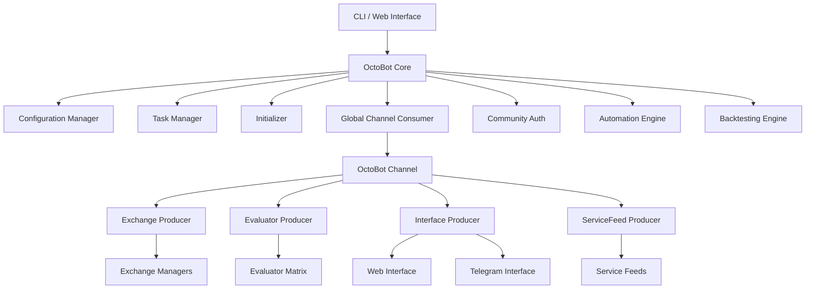
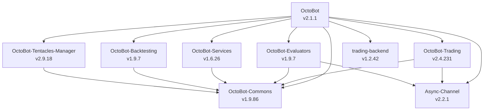

# OctoBot Documentation

## Project Overview

OctoBot is a modular, open-source cryptocurrency trading bot developed by [Drakkar-Software](https://github.com/Drakkar-Software). Built in Python, it uses a plugin architecture called **Tentacles** to provide extensible trading strategies, evaluators, and exchange integrations. OctoBot supports both live trading and backtesting with a focus on automation, community-driven strategies, and multi-exchange support.

- **Version**: 2.1.1
- **License**: GPL-3.0
- **Python**: 3.13+
- **Author**: Drakkar-Software

## Key Features

- **Modular Tentacles System** -- Plugin architecture for evaluators, trading modes, exchanges, and services. Install, update, and configure tentacles independently.
- **Multi-Exchange Support** -- Connect to multiple cryptocurrency exchanges simultaneously with real or simulated trading.
- **Evaluator Framework** -- Technical Analysis (TA), Social, and Real-Time evaluators feed into strategy evaluators that drive trading decisions.
- **Backtesting Engine** -- Replay historical market data with configurable time windows, multiple data files, and memory leak detection.
- **Strategy Optimizer** -- Automated brute-force and genetic algorithm optimization across evaluators, time frames, and risk levels.
- **Automation System** -- Trigger-condition-action workflows for automated bot management (stop on drawdown, send notifications, etc.).
- **Community Integration** -- OctoBot Cloud connectivity for profile sharing, signal following, TradingView webhooks, and metrics reporting.
- **Web Interface** -- Browser-based dashboard for configuration, monitoring, and backtesting.
- **Telegram Interface** -- Bot control and notifications via Telegram.
- **Notification System** -- Configurable alerts through multiple channels (Telegram, web, email, etc.).
- **Docker Support** -- Production-ready Docker and Docker Compose configurations.
- **Distribution Modes** -- Default, Market Making, Prediction Market, Node (distributed), and Sync modes.

## Links

| Resource | URL |
|----------|-----|
| GitHub | [github.com/Drakkar-Software/OctoBot](https://github.com/Drakkar-Software/OctoBot) |
| Website | [octobot.cloud](https://www.octobot.cloud) |
| Documentation | [octobot.cloud/en/guides](https://www.octobot.cloud/en/guides) |
| Developer Docs | [octobot.cloud/en/guides/developers](https://www.octobot.cloud/en/guides/developers/) |
| Exchange Guides | [octobot.cloud/en/guides/exchanges](https://www.octobot.cloud/en/guides/exchanges/) |
| Feedback | [feedback.octobot.cloud](https://feedback.octobot.cloud/) |

## Quick Start

The simplest way to launch OctoBot is in **simulation mode**, which requires no exchange API keys. OctoBot creates a default configuration on first run:

```bash
# 1. Install OctoBot
pip install -e ".[full]"

# 2. Install default tentacles (evaluators, trading modes, etc.)
python start.py tentacles --install --all

# 3. Start in simulation mode (no real money, no API keys)
python start.py --simulate

# Web interface opens at http://localhost:5001
# Configure trading pairs and strategies from the browser.
```

For a **backtesting** example (fully offline, no keys needed):

```bash
# Collect sample data first via the web UI, then:
python start.py --backtesting --backtesting-files user/data/binance_BTC_USDT_1h.data

# Or use the strategy optimizer:
python start.py -o TechnicalAnalysisStrategyEvaluator
```

**Programmatic usage** (embed OctoBot in your own script):

```python
"""Minimal OctoBot launch -- simulation mode, no web UI."""
import asyncio
from octobot.cli import main

# Equivalent to: python start.py --simulate --no_web --no-telegram
asyncio.run(main(["--simulate", "--no_web", "--no-telegram"]))
```

Key CLI flags: `--simulate` (paper trading), `--backtesting` (historical replay), `--no_web` (headless), `--no-telegram` (skip Telegram), `--encrypter` (encrypt API keys), `-r 0.5` (set risk level 0-1).

## OctoBotAPI Reference

The `OctoBotAPI` class (`src/octobot/octobot_api.py`) provides the public interface for interacting with a running OctoBot instance programmatically:

| Method | Return Type | Description |
|--------|-------------|-------------|
| `is_initialized()` | `bool` | Whether the bot has completed initialization |
| `get_exchange_manager_ids()` | `list` | IDs of all active exchange manager instances |
| `get_global_config()` | `dict` | Current bot configuration dictionary |
| `get_startup_config(dict_only)` | `dict` | Configuration snapshot from startup |
| `get_edited_config(dict_only)` | `dict` | Current edited (unsaved) configuration |
| `get_startup_tentacles_config()` | `object` | Tentacle config as loaded at startup |
| `get_edited_tentacles_config()` | `object` | Current edited tentacle configuration |
| `set_edited_tentacles_config(config)` | `None` | Replace edited tentacle configuration |
| `get_trading_mode()` | `object` | Active trading mode instance |
| `get_tentacles_setup_config()` | `object` | Full tentacles setup configuration |
| `get_startup_messages()` | `list` | Messages generated during startup |
| `get_start_time()` | `float` | Bot start timestamp (epoch) |
| `get_bot_id()` | `str` | Unique bot identifier |
| `get_matrix_id()` | `str` | Evaluator matrix identifier |
| `get_aiohttp_session()` | `object` | Shared aiohttp client session |
| `get_automation()` | `Automation` | Automation engine instance |
| `get_interface(interface_class)` | `object` | Get a specific interface by class |
| `run_in_main_asyncio_loop(coro)` | `Future` | Schedule coroutine in bot's main loop |
| `run_in_async_executor(coro)` | `object` | Run coroutine in async executor |
| `stop_all_trading_modes_and_pause_traders(...)` | `None` | Emergency stop all trading |
| `stop_tasks()` | `None` | Stop all bot tasks |
| `stop_bot()` | `None` | Gracefully shut down the bot |
| `restart_bot()` | `None` | Restart the bot process (static) |
| `update_bot()` | `None` | Update OctoBot to latest version |

Access the API from tentacles or custom code:

```python
from octobot.octobot_api import OctoBotAPIProvider

api = OctoBotAPIProvider.instance().get_api(bot_id)
config = api.get_global_config()
```

## Architecture Overview

OctoBot follows an event-driven, channel-based architecture. The core `OctoBot` class orchestrates four producers (Exchange, Evaluator, Interface, ServiceFeed) that communicate through the `OctoBotChannel`. Tentacles provide all pluggable functionality -- evaluators, trading modes, services, and interfaces.



See [architecture.md](architecture.md) for detailed component diagrams.

## Component Summary

| Component | Location | Purpose |
|-----------|----------|---------|
| OctoBot Core | `src/octobot/octobot.py` | Main bot class, lifecycle management |
| Task Manager | `src/octobot/task_manager.py` | Async loop and thread management |
| Initializer | `src/octobot/initializer.py` | Tentacle config loading, storage init |
| Channel System | `src/octobot/channels/` | OctoBotChannel for inter-component messaging |
| Global Consumer | `src/octobot/octobot_channel_consumer.py` | Routes channel events to appropriate handlers |
| Exchange Producer | `src/octobot/producers/exchange_producer.py` | Creates and manages exchange connections |
| Evaluator Producer | `src/octobot/producers/evaluator_producer.py` | Creates evaluator matrix and evaluator instances |
| Interface Producer | `src/octobot/producers/interface_producer.py` | Creates web/telegram interfaces and notifiers |
| ServiceFeed Producer | `src/octobot/producers/service_feed_producer.py` | Creates and starts service data feeds |
| Backtesting | `src/octobot/backtesting/` | Historical data replay engine |
| Strategy Optimizer | `src/octobot/strategy_optimizer/` | Automated strategy parameter optimization |
| Automation | `src/octobot/automation/` | Trigger-condition-action automation framework |
| Community | `src/octobot/community/` | Cloud auth, feeds, profiles, metrics |
| Configuration | `src/octobot/configuration_manager.py` | Config versioning (startup, edited, current) |
| Storage | `src/octobot/storage/` | Run metadata and database management |
| API | `src/octobot/api/` | Public API for backtesting, optimizer, updater |
| CLI | `src/octobot/cli.py` | Command-line interface and argument parsing |

## Documentation Index

| Document | Description |
|----------|-------------|
| [architecture.md](architecture.md) | System architecture, component diagrams, tentacle system |
| [workflow.md](workflow.md) | Trading signal flow, key workflows, event/channel system |
| [state-management.md](state-management.md) | Bot lifecycle, evaluator states, order tracking |
| [development.md](development.md) | Setup, project structure, tentacle development guide |

## OctoBot Ecosystem

OctoBot is built on a family of companion packages that each handle a specific domain:



| Package | Purpose |
|---------|---------|
| **OctoBot-Commons** | Shared utilities, configuration, logging, database, enums, tree structures |
| **OctoBot-Trading** | Exchange management, order execution, portfolio tracking, trading modes |
| **OctoBot-Evaluators** | Evaluator framework, matrix system, TA/Social/RealTime evaluator bases |
| **OctoBot-Tentacles-Manager** | Tentacle installation, activation, configuration, packaging |
| **OctoBot-Services** | Service interfaces (web, telegram), notifications, service feeds |
| **OctoBot-Backtesting** | Backtesting infrastructure, data importers, time simulation |
| **Async-Channel** | Asynchronous channel/consumer/producer messaging framework |
| **trading-backend** | Exchange-specific backend adapters and broker integration |
| **OctoBot-Tentacles** | Default tentacle package with evaluators, trading modes, and services (installed separately) |
