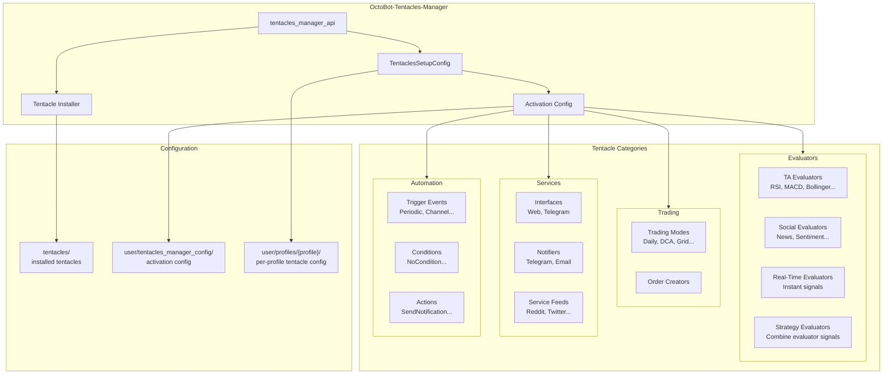
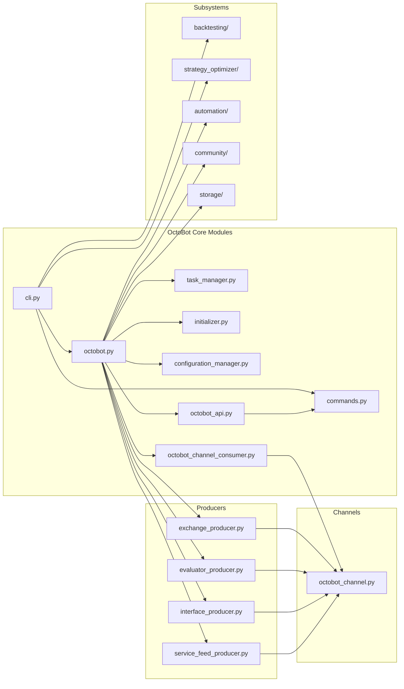

# OctoBot Architecture

## System Architecture

OctoBot uses an event-driven, channel-based architecture where the core orchestrator creates producers that communicate through a central `OctoBotChannel`. All extensible functionality is delivered through the Tentacles plugin system.

```mermaid
graph TB
    subgraph Entry["Entry Points"]
        CLI[CLI<br/>cli.py]
        WebUI[Web Interface<br/>InterfaceProducer]
        API[OctoBotAPI<br/>octobot_api.py]
    end

    subgraph Core["OctoBot Core"]
        OB[OctoBot<br/>octobot.py]
        CM[ConfigurationManager<br/>configuration_manager.py]
        TM[TaskManager<br/>task_manager.py]
        Init[Initializer<br/>initializer.py]
    end

    subgraph Channel["Channel System"]
        OC[OctoBotChannel<br/>channels/octobot_channel.py]
        GC[OctoBotChannelGlobalConsumer<br/>octobot_channel_consumer.py]
        TC[Trading Channel Consumer]
        EC[Evaluator Channel Consumer]
        SC[Service Channel Consumer]
    end

    subgraph Producers["Producers"]
        EP[ExchangeProducer<br/>producers/exchange_producer.py]
        EvP[EvaluatorProducer<br/>producers/evaluator_producer.py]
        IP[InterfaceProducer<br/>producers/interface_producer.py]
        SFP[ServiceFeedProducer<br/>producers/service_feed_producer.py]
    end

    subgraph External["Ecosystem Packages"]
        OT[OctoBot-Trading]
        OE[OctoBot-Evaluators]
        OS[OctoBot-Services]
        OB_BT[OctoBot-Backtesting]
        OTM[OctoBot-Tentacles-Manager]
        AC[Async-Channel]
    end

    subgraph Community["Community"]
        CA[CommunityAuthentication<br/>community/authentication.py]
        CMgr[CommunityManager<br/>community/community_manager.py]
        Feeds[Community Feeds<br/>community/feeds/]
        SB[Supabase Backend<br/>community/supabase_backend/]
    end

    subgraph Automation["Automation"]
        Auto[Automation<br/>automation/automation.py]
        Trigger[AbstractTriggerEvent]
        Cond[AbstractCondition]
        Act[AbstractAction]
    end

    CLI --> OB
    OB --> CM
    OB --> TM
    OB --> Init
    OB --> GC

    GC --> OC
    OC --> EP
    OC --> EvP
    OC --> IP
    OC --> SFP

    GC --> TC
    GC --> EC
    GC --> SC

    EP --> OT
    EvP --> OE
    IP --> OS
    SFP --> OS
    OC --> AC

    OB --> CA
    OB --> CMgr
    OB --> Auto

    Auto --> Trigger
    Auto --> Cond
    Auto --> Act

    Init --> OTM
```

## Trading Paradigm & Key Features

| Feature | Support | Details |
|---------|---------|---------|
| Backtesting Approach | Event-driven | Replays historical candles through the full evaluator-strategy-trading mode pipeline via `OctoBotBacktesting` |
| Live Trading | Yes | Real trading on crypto exchanges via ccxt (REST and WebSocket); configurable per-profile |
| Paper Trading | Yes | Built-in simulator mode (`--simulate`); simulated exchange fills orders at market price |
| Multi-Asset | Yes | Crypto spot and futures across all ccxt-supported exchanges (Binance, Bybit, OKX, Coinbase, Kraken, etc.) |
| Data Feeds | Multiple sources | Exchange REST and WebSocket via ccxt; social feeds (Reddit, Twitter); community signals (MQTT/WebSocket); custom service feeds via tentacles |
| ML Integration | No | No built-in ML; extensible via custom evaluator tentacles that can wrap ML models |
| Risk Management | Custom | Risk level setting (0-1) in trader config; trading mode controls position sizing; automation engine can stop trading on drawdown |
| Optimization | Yes | `StrategyOptimizer` (brute-force over TA evaluators, time frames, risk levels) and `StrategyDesignOptimizer` (genetic algorithm with configurable mutation, generations, scoring) |
| Execution | Both | Simulated execution in backtesting; live execution on exchanges via ccxt; order creation delegated to trading mode tentacles |

## Core Components

### OctoBot Main Class (`octobot.py`)

The central orchestrator that manages the bot lifecycle. Key responsibilities:

- **Configuration**: Holds the global config and manages startup/edited configuration states through `ConfigurationManager`
- **Initialization**: Delegates to `Initializer` for tentacles config loading and storage initialization
- **Producer Creation**: Creates four producers (Exchange, Evaluator, Interface, ServiceFeed) that operate on the `OctoBotChannel`
- **Lifecycle**: Manages `initialize()` -> running -> `stop()` with graceful shutdown of all subsystems
- **Bot Identity**: Each instance gets a unique `bot_id` (UUID) used across all subsystems

Key attributes:
- `tentacles_setup_config` -- loaded tentacle activation and configuration
- `configuration_manager` -- tracks startup, edited, and current config states
- `global_consumer` -- the `OctoBotChannelGlobalConsumer` that routes all channel events
- `exchange_producer`, `evaluator_producer`, `interface_producer`, `service_feed_producer` -- the four core producers
- `community_auth` -- handles OctoBot Cloud authentication
- `automation` -- the trigger-condition-action automation engine

### Tentacles System (Plugin Architecture)

Tentacles are OctoBot's plugin mechanism. Every evaluator, trading mode, service, and interface is a tentacle. The system is managed by `OctoBot-Tentacles-Manager`.

Key concepts:
- **Activation**: Each tentacle can be enabled/disabled in the tentacles setup config
- **Configuration**: Tentacles have per-tentacle config stored in profile-specific directories
- **Discovery**: Tentacles are discovered through Python class inheritance (e.g., all subclasses of `TAEvaluator`)
- **Packaging**: Tentacles are distributed as zip packages, installed via `tentacles --install --all`
- **User Inputs**: Tentacles define configurable parameters through `init_user_inputs()` using the `UI` helper

### Evaluators

Evaluators analyze market data and produce trading signals. Three types exist:

| Type | Base Class | Purpose | Examples |
|------|-----------|---------|----------|
| **TA (Technical Analysis)** | `TAEvaluator` | Analyze price/volume data using indicators | RSI, MACD, Bollinger Bands |
| **Social** | `SocialEvaluator` | Analyze social media and news sentiment | Reddit, Twitter, News feeds |
| **Real-Time** | `RealTimeEvaluator` | Process live market data for instant signals | Order book analysis, tick data |

Evaluators feed into **Strategy Evaluators** (`StrategyEvaluator`) that combine multiple evaluator signals into a unified trading decision using the **Evaluator Matrix**.

The `EvaluatorProducer` initializes all evaluators, creates the matrix, and sets up evaluator channels. It sends `CREATION` events via the `OctoBotChannel` to trigger evaluator instantiation.

### Trading Modes

Trading modes define how trading signals from evaluators are translated into actual orders. Examples include:

- **DailyTradingMode** -- Standard daily trading based on evaluator signals
- **DCA (Dollar Cost Averaging)** -- Periodic buying at regular intervals
- **Grid Trading** -- Place buy/sell orders at predefined price levels
- **Market Making** -- Provide liquidity by placing orders on both sides

Trading modes are activated per-profile in the tentacles setup config. Only one trading mode can be active at a time.

### Exchange Management

The `ExchangeProducer` handles exchange lifecycle:

1. Reads enabled exchanges from config
2. Sends `CREATION` events via OctoBotChannel for each exchange
3. The trading channel consumer creates `ExchangeManager` instances (from `OctoBot-Trading`)
4. Tracks created exchange IDs and signals when all exchanges are ready via `created_all_exchanges` event
5. Supports both real and simulated trading modes

### Community Integration

The community subsystem (`src/octobot/community/`) provides:

- **Authentication** (`authentication.py`) -- Supabase-based auth with session management, JWT refresh, auto-reauthentication
- **Community Manager** (`community_manager.py`) -- Metrics reporting, bot registration, profitability tracking
- **Feeds** (`feeds/`) -- MQTT and WebSocket feeds for community signals (e.g., copy trading)
- **Supabase Backend** (`supabase_backend/`) -- Database operations for bots, profiles, signals
- **Wallet Backend** (`wallet_backend/`) -- Wallet management for community features
- **Tentacles Packages** (`tentacles_packages.py`) -- Community tentacle package management
- **History Backend** (`history_backend/`) -- Clickhouse and Iceberg backends for historical data

Environments: Production (`octobot.cloud`) and Staging (`beta.octobot.cloud`), switchable via `CommunityEnvironments` enum.

### Backtesting Engine

The backtesting system (`src/octobot/backtesting/`) replays historical data:

- **OctoBotBacktesting** (`octobot_backtesting.py`) -- Core backtesting orchestrator
  - Initializes matrix, evaluators, exchanges, and service feeds for simulated execution
  - Configurable time windows (`start_timestamp`, `end_timestamp`)
  - Memory leak detection via `memory_leak_checkup()`
  - Run metadata storage for result analysis
- **OctoBotBacktestingFactory** (`octobot_backtesting_factory.py`) -- CLI entry point that extends `OctoBot` for backtesting mode
- **IndependentBacktesting** (`independent_backtesting.py`) -- Standalone backtesting usable from the web interface

### Strategy Optimizer

The optimizer (`src/octobot/strategy_optimizer/`) finds optimal configurations:

- **StrategyOptimizer** -- Iterates over combinations of TA evaluators, time frames, and risk levels
- **StrategyDesignOptimizer** -- Genetic algorithm-based optimization with configurable mutation rates, generations, and scoring
- **StrategyTestSuite** -- Runs backtesting test suites for each configuration
- **Fitness/Scoring** -- `FitnessParameter`, `ScoredRunResult`, `OptimizerFilter`, `OptimizerConstraint` for result evaluation

### Automation Engine

The automation system (`src/octobot/automation/`) provides a trigger-condition-action framework:

- **AutomationStep** -- Base class for all automation components
- **AbstractTriggerEvent** -- Async generator that yields events (e.g., periodic check, channel event)
- **AbstractCondition** -- Validates whether automation should proceed
- **AbstractAction** -- Executes the automated action (e.g., send notification, stop trading)
- **Automation** -- Orchestrator that loads config, creates `AutomationDetails`, and runs automation tasks

Automations are configured per-profile through user inputs and support multiple trigger/condition/action combinations.

## Module Dependency Diagram

---
## See Also
- [README](README.md) — Project overview and quick start
- [Workflow](workflow.md) — Event flows and processing pipelines
- [State Management](state-management.md) — State lifecycle and data models
- [Development](development.md) — Development guide and best practices
