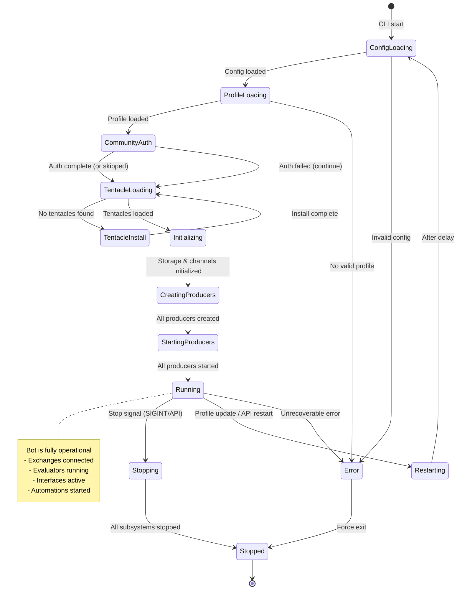
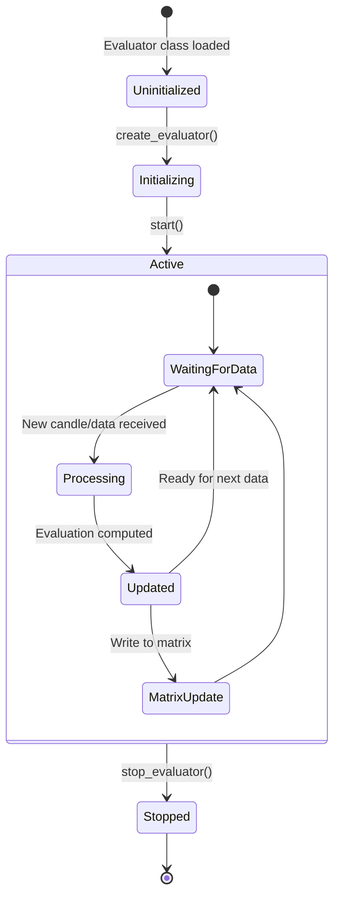
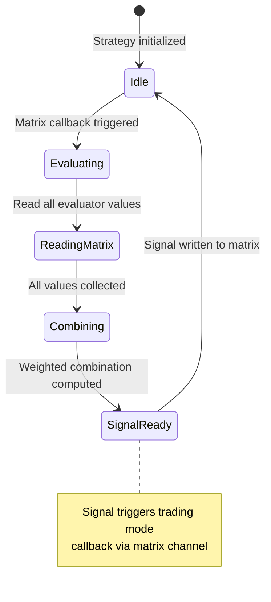
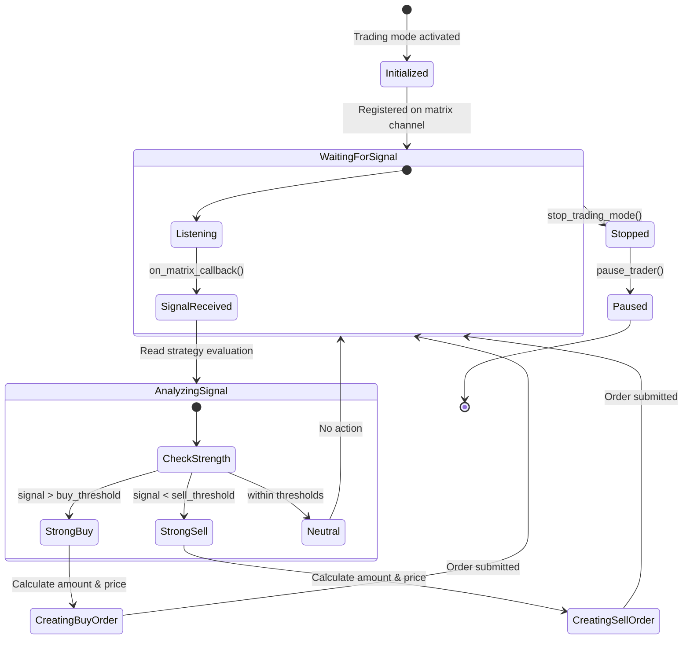
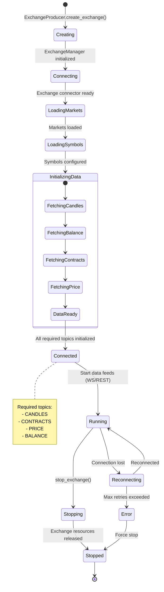
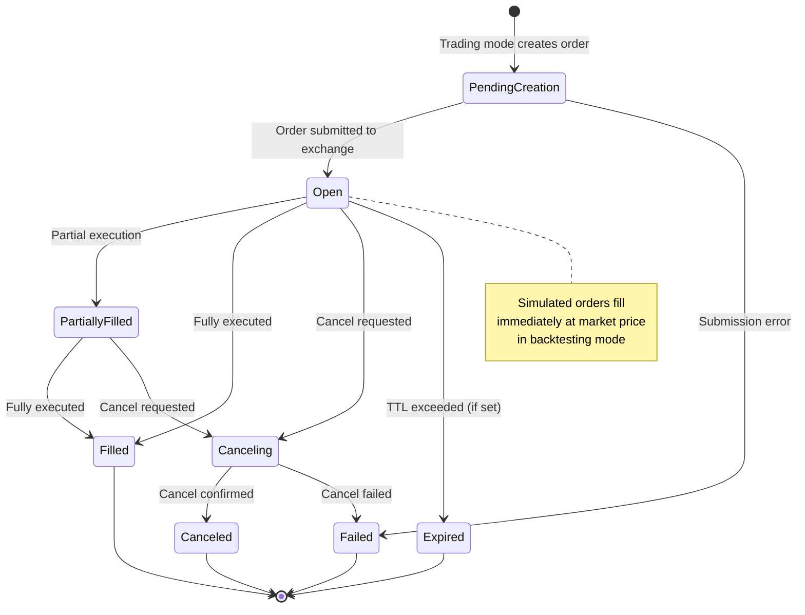
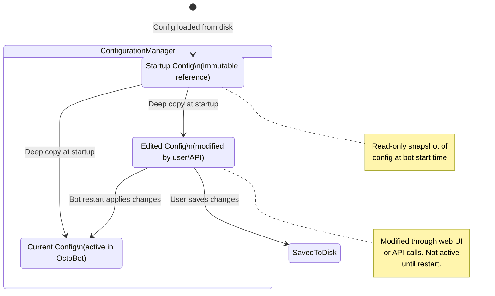
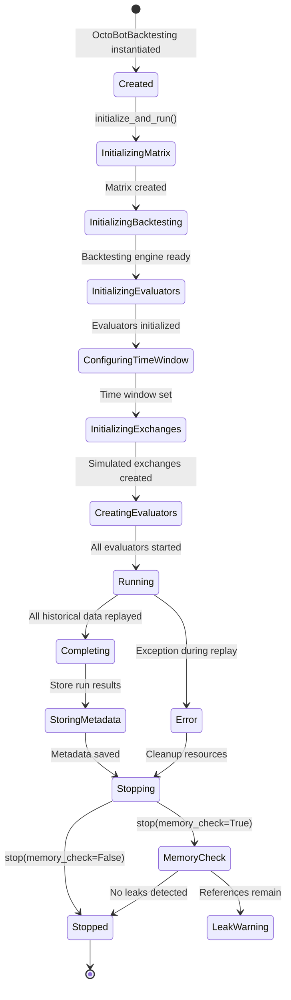
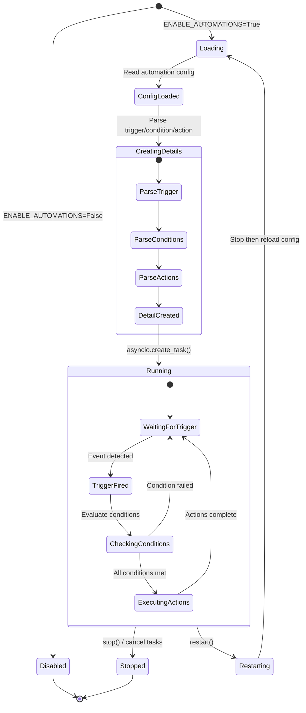

# OctoBot State Management

## Bot Lifecycle

The OctoBot bot goes through a well-defined lifecycle from startup through running to shutdown.



### Initialization Sequence States

The `OctoBot.initialize()` method progresses through these internal states:

| State | Code Location | What Happens |
|-------|---------------|-------------|
| Clock Sync | `_ensure_clock()` | Synchronize system clock (if real trading enabled) |
| Community Auth Init | `community_auth.init_account()` | Initialize community account session |
| Tentacles Config | `initializer.create()` | Load `tentacles_setup_config`, init bot storage, create OctoBotChannel |
| Log Config | `_log_config()` | Log exchanges, trader type, symbols, trading mode |
| Tools Tasks | `_start_tools_tasks()` | Init aiohttp session, start community handler |
| Create Producers | `create_producers()` | Instantiate Exchange, Evaluator, Interface, ServiceFeed producers |
| Start Producers | `start_producers()` | Run evaluators, exchanges, service feeds, interfaces in order |
| System Watchers | `_ensure_watchers()` | Start RAM/resource monitoring if enabled |
| Post Initialize | `_post_initialize()` | Set `initialized=True`, start automations, store metadata |

### The `initialized` Flag

The `OctoBot.initialized` attribute is the primary readiness indicator:

- **`False`** during startup -- APIs should not serve data yet
- **`True`** after `_post_initialize()` completes -- bot is fully operational
- Checked by `OctoBotAPI.is_initialized()` which web interfaces use to gate requests

## Evaluator State Management

Evaluators maintain state through the **Evaluator Matrix**, a centralized data structure managed by `OctoBot-Evaluators`.



### Matrix Evaluation Values

Each evaluator writes a normalized value to the matrix:

| Value Range | Meaning |
|-------------|---------|
| `-1.0` | Strong sell signal |
| `-0.5` | Moderate sell signal |
| `0.0` | Neutral / no signal |
| `+0.5` | Moderate buy signal |
| `+1.0` | Strong buy signal |

The matrix is indexed by:
- **Exchange name**
- **Symbol** (trading pair)
- **Time frame** (for TA evaluators)
- **Evaluator name**

Strategy evaluators read all relevant matrix entries and produce a combined signal.

### Strategy Evaluator State



## Trading Mode States

Trading modes interpret strategy signals and manage order creation.



### Trading Mode Pause/Stop

The `ExchangeProducer` can stop all trading modes and pause traders through:

```
OctoBotAPI.stop_all_trading_modes_and_pause_traders(stop_reason, execution_details)
  --> ExchangeProducer.stop_all_trading_modes_and_pause_traders()
    --> send(STOP_EXCHANGE_TRADING_MODES_AND_PAUSE_TRADER) via OctoBotChannel
      --> Trading consumer handles the stop/pause action per exchange
```

This is used by the automation system (e.g., stop on drawdown) and community bot error handling.

## Exchange Connection States



### Exchange Creation Tracking

The `ExchangeProducer` tracks exchange creation progress:

```
to_create_exchanges_count: int  -- total exchanges to create
exchange_manager_ids: list[str] -- IDs of created exchanges
created_all_exchanges: asyncio.Event  -- set when all exchanges are created
```

When `len(exchange_manager_ids) == to_create_exchanges_count`, the `created_all_exchanges` event fires. This gates:
- Run metadata storage
- Automation initialization
- Community bot status reporting

## Order State Tracking

Orders go through states managed by `OctoBot-Trading`:



## Configuration State Management

OctoBot maintains three versions of configuration simultaneously:



The `ConfigurationManager` tracks both `CONFIG_KEY` (global config) and `TENTACLES_SETUP_CONFIG_KEY` (tentacle activation) using `ConfigurationElement` instances that hold:
- `config` -- the original element
- `startup_config` -- deep copy at creation time
- `edited_config` -- deep copy that receives user modifications

## Backtesting State



## Automation State



> **Note:** Order states (`PendingCreation`, `Open`, `PartiallyFilled`, `Filled`, `Canceling`, `Canceled`, `Failed`, `Expired`) are defined in the companion [`OctoBot-Trading`](https://github.com/Drakkar-Software/OctoBot-Trading) package, not in the core OctoBot repository. The order state machine above reflects the states managed by that package's order management system.

---
## See Also
- [README](README.md) — Project overview and quick start
- [Architecture](architecture.md) — System design and components
- [Workflow](workflow.md) — Event flows and processing pipelines
- [Development](development.md) — Development guide and best practices
