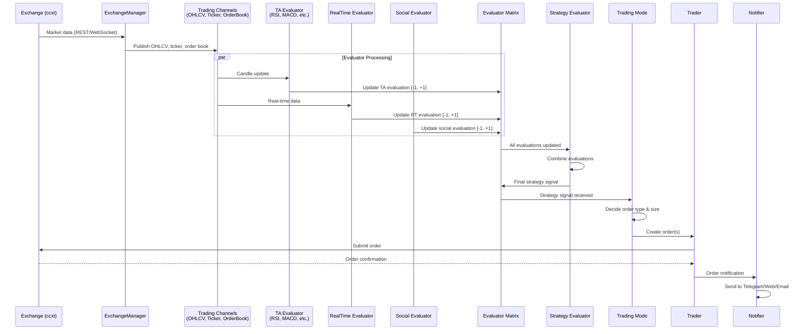
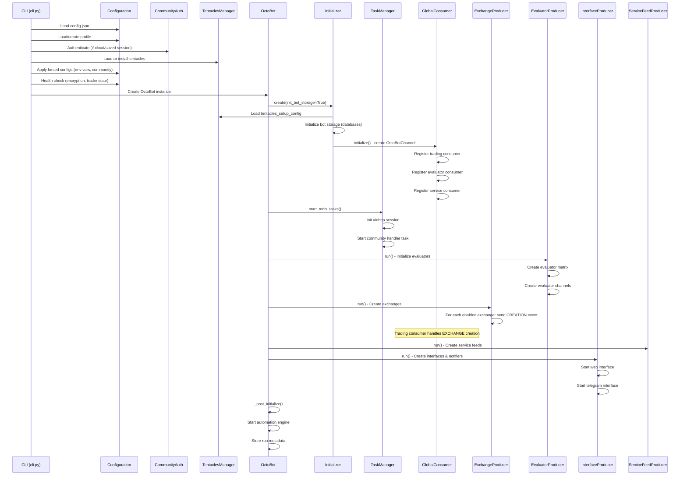
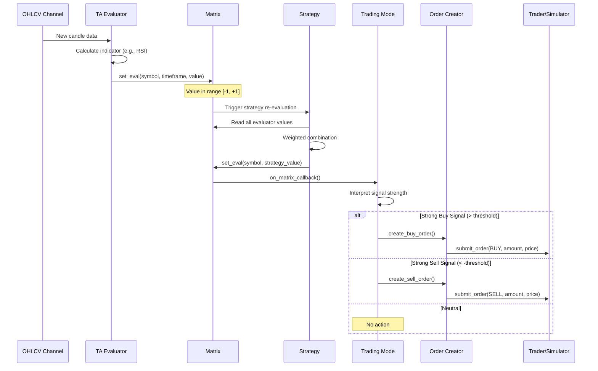
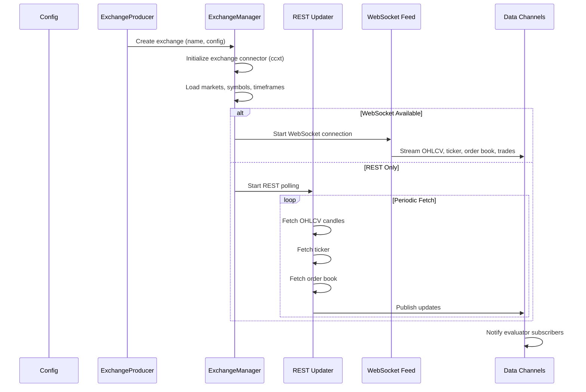
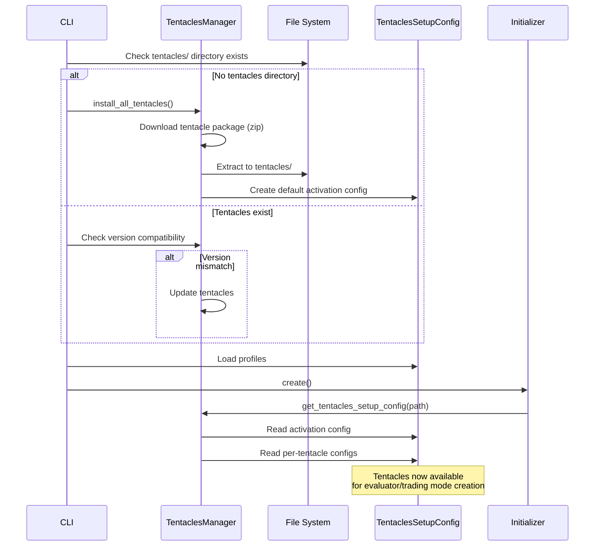
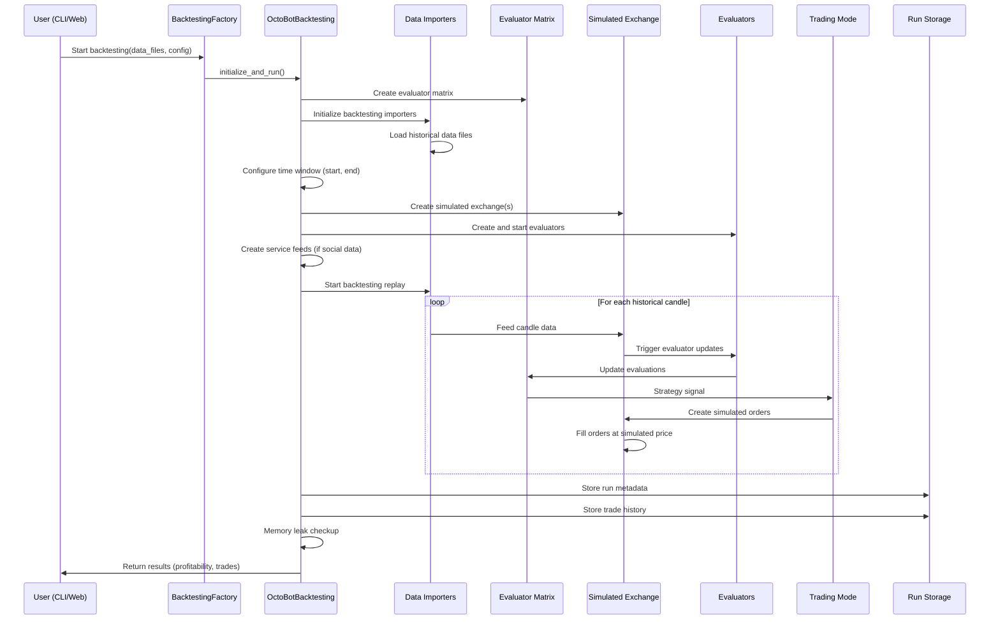
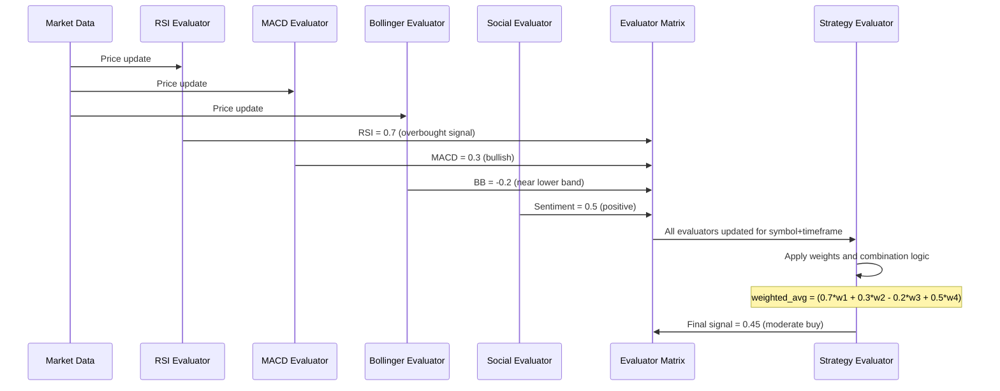
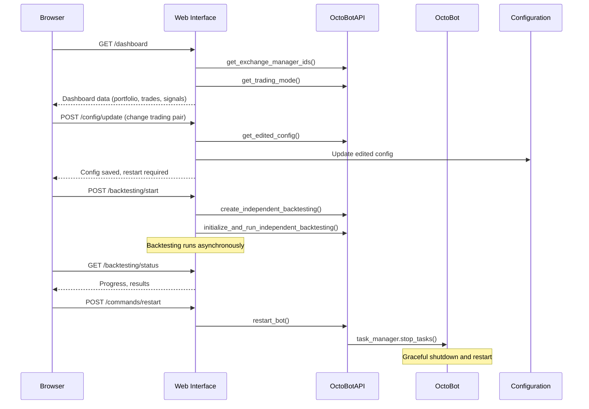
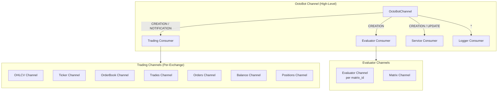
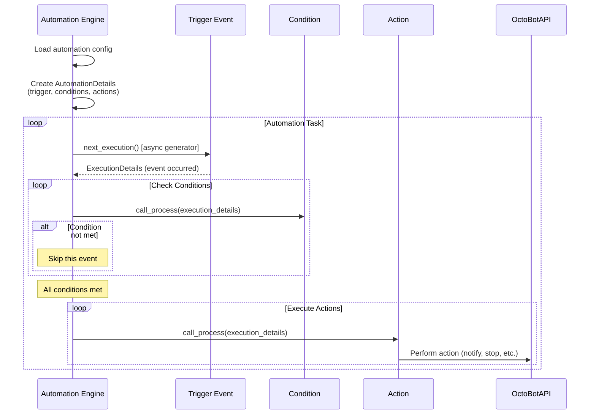

# OctoBot Workflows

## Trading Signal Flow

The primary data flow in OctoBot goes from market data through evaluators and strategies to order execution.

## Key Workflows

### 1. Bot Initialization and Startup

### 2. Evaluator to Trading Mode to Order

This is the core trading loop that runs continuously:

### 3. Market Data Collection

### 4. Tentacle Loading and Initialization

### 5. Backtesting Execution

### 6. Strategy Evaluation Cycle

### 7. Web Interface Events

## Event/Channel System

OctoBot uses a hierarchical channel system for inter-component communication:

### Channel Message Structure

Messages on the `OctoBotChannel` follow this format:

| Field | Type | Description |
|-------|------|-------------|
| `bot_id` | `str` | UUID identifying the bot instance |
| `subject` | `str` | `CREATION`, `UPDATE`, or `NOTIFICATION` |
| `action` | `str` | Specific action (e.g., `EXCHANGE`, `EVALUATOR`, `INTERFACE`) |
| `data` | `dict` | Action-specific payload |

### Consumer Routing

The `OctoBotChannelGlobalConsumer` dispatches messages based on action:

| Action | Handler | Effect |
|--------|---------|--------|
| `EXCHANGE` (notification) | `ExchangeProducer.register_created_exchange_id()` | Register new exchange, create evaluators for it |
| `EVALUATOR` (notification) | `ServiceFeedProducer.start_feeds()` | Start service feeds after evaluators register requirements |
| `INTERFACE` (notification) | `InterfaceProducer.register_interface()` | Register web/telegram interface |
| `NOTIFICATION` (notification) | `InterfaceProducer.register_notifier()` | Register notification handler |
| `SERVICE_FEED` (notification) | `ServiceFeedProducer.register_service_feed()` | Register service data feed |
| `EXCHANGE` (creation) | Trading consumer | Create ExchangeManager via OctoBot-Trading |
| `EVALUATOR` (creation) | Evaluator consumer | Create evaluator instances via OctoBot-Evaluators |
| `INTERFACE` (creation) | Service consumer | Create interface via OctoBot-Services |
| `STOP_EXCHANGE_TRADING_MODES` (update) | Trading consumer | Stop trading and pause trader on exchange |

### Automation Workflow

---
## See Also
- [README](README.md) — Project overview and quick start
- [Architecture](architecture.md) — System design and components
- [State Management](state-management.md) — State lifecycle and data models
- [Development](development.md) — Development guide and best practices
